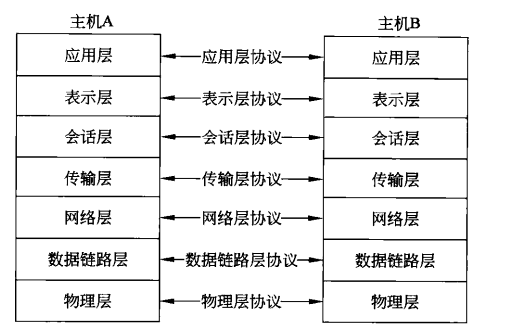
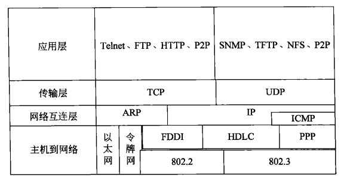
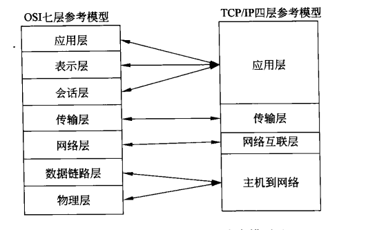
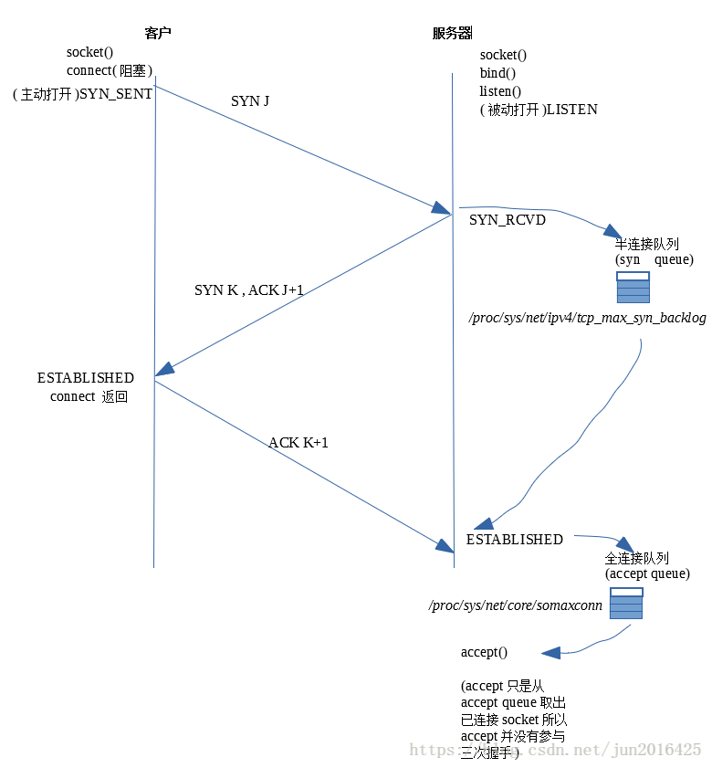

## HTTP

### 网络基础

#### 开放式系统
> 

##### OSI(open system Interconnect)参考模型
> OSI模型是国际标准化组织创建的一种标准。它为开放式系统环境定义了一种分层模型，其中，如果两个系统采用了相同的OSI层通讯协议，那么一台计算机上运行的一个进程就可以和另一台计算机上的类似进程通信。

**七层模型**

- 应用层：网络服务与最终用户的一个接口。常见协议：HTTP FTP TFTP SMTP SNMP DNS TELNET HTTPS POP3 DHCP
- 表示层：数据的表示、安全、压缩。
- 会话层：建立、管理、终止会话。
- 传输层：定义传输数据的协议端口号，以及流控和差错校验。常见协议：TCP、UDP
- 网络层：进行逻辑地址寻址，实现不同网络之间的路径选择。常见协议：IP协议
- 数据链路层：建立逻辑连接、进行硬件地址寻址、差错校验等功能。
- 物理层：建立、维护、断开物理连接

#### 什么是TCP/IP协议簇(互联网协议族)
> 是一个网络通信模型，TCP/IP是一组协议的代名词，包括许多别的协议，组成了TCP/IP协议簇。其中比较重要的有SLIP协议、PPP协议、IP协议、ICMP协议、ARP协议、TCP协议、UDP协议、FTP协议、DNS协议、SMTP协议等。

**四层模型**

- 应用层：将OSI的会话层和表示层取消，功能被合并到应用层。
- 传输层：提供源主机和目标主机上的对等层之间可以进行对话的机制。定义了两种协议，TCP和UDP。TCP是面向连接，可靠的协议。提供了窗口控制，超时重发等方法，将数据发送到互联网上的其他主机。UDP是不可靠的，无连接的协议，适用于不怕数据丢失，不需要对报文进行排序，流量控制的场景。
- 网络互联层：是TCP/IP协议栈的核心。将数据进行分组并发到目的主机或者网络。这一层定义了数据包的分组格式和协议，采用的是IP协议，因此网络互联层经常被称为IP层。
- 主机到网络：TCP/IP并没有给出具体实现，仅仅规定了给上一层的网络互联层提供的访问接口，可以传输IP数据包，具体实现随网络类型的不同而不同。

**两者差别**

#### 为什么使用TCP/IP协议簇
由于OSI参考模型过于庞大和复杂，在实现的时候造成了很大的困难。在实际中，TCP/IP协议簇(栈)获得了更加广泛的应用。主流的操作系统基本上都采用TCP/IP协议簇(栈)。

#### TCP与UDP
 对比 | TCP | UDP
:---: |:---:| :---:
是否连接 | 面向连接 | 面向非连接
传输可靠性 | 可靠的 | 不可靠的
应用场合 | 传输大量的数据 | 少量数据
速度 | 慢 | 快

##### TCP如何保障传输可靠性

- 相互进行通信的设备或服务之间保持一个虚拟连接(3次握手)，并且TCP会为每一个它发送的数据包提供序号，当数据包接收无序、丢失、或者损坏时，负责修复。
- TCP要求目标计算机在成功收到数据时，返回一个确认(ACK)，如果未返回，发送端将重新发送该数据。
- 在网络堵塞时，接收端可能收到多个重复数据包，可通过序号进行判断是否为重复数据，并在必要时丢弃。

#### TCP三次握手

- 第一次握手：客户端向服务端发送连接请求。服务端接收，放入半连接队列中，如果半连接队列已满，则丢弃该连接。
- 第二次握手：服务端返回SYN+ACK给到客户端。
- 第三次握手：客户端返回ACK给服务端。服务端接收，放入全连接队列中。如果全连接队列已满。则根据tcp_abort_on_overflow的值来执行相应动作。
  - tcp_abort_on_overflow = 0：定时重新发起第二次握手。发送机制采用'二进制指数退让'
  - tcp_abort_on_overflow = 1：重置连接(先通过RST包，中断此次连接，然后发起新的连接)

##### SYN flood攻击

> SYN Flood（半开放攻击）是一种拒绝服务（DDoS）攻击,其目的是通过消耗所有可用的服务器资源，使服务器不可用于合法流量。通过重复发送初始连接请求（SYN）数据包，攻击者能够压倒目标服务器机器上的所有可用端口，导致目标设备根本不响应合法流量。

##### 如何减轻SYN flood攻击

- 增加积压队列：增大半开连接的最大数量
- 回收最早的半开TCP连接
- SYN Cookie：

##### TCP连接为什么是三次握手，而不是2次握手？

在网络堵塞时，TCP连接的第一次握手，在连接释放后才到达服务端，这时服务端会以为客户端要创建一个新的连接，返回SYN+ACK，如果是2次握手，那么，此时无效连接就已创建。

