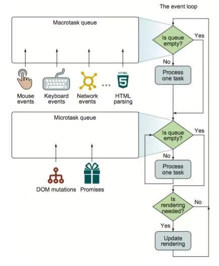
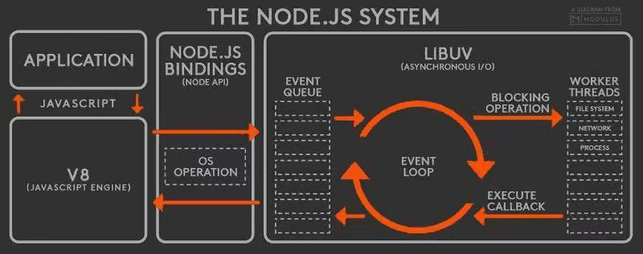
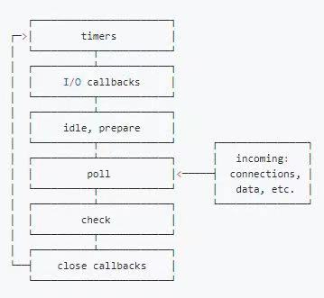

## JS面试题
#### 堆内存与栈内存
> 堆内存(heap)：一个混沌，杂乱无章，方便存储和开辟内存空间
> 栈内存(stack)：一种线性结构(系统自动分配，并有系统自动释放)

#### 数据类型
> 基本数据类型：Numberr、String、Boolean、null、undefined、Symbol
> 引用数据类型：Object

#### 闭包
> 函数执行后返回一个内部函数，并被外部变量引用，如果内部函数持有被执行函数作用域的变量，即形成了闭包
```js
const fn = function () {
    let i = 0;
    return function () {
        return i++
    }
}
```

#### 作用域和作用域链
> 作用域：变量和函数可用范围
- 私有作用域：函数执行都会形成一个私有作用域
- 全局作用域：页面一打开就会行程一个全局作用域
- 块级作用域：由let、const 关键字，由大括号包裹，生成一个块级作用域
- 全局变量：全局变量有全局作用域，可以在程序中任何地方访问
- 局部变量：只有在其作用域内才能被访问

> 作用域链：解决标识符的访问机制，该链中包含多个对象，在对标识符进行求值的过程中，会从链首的对象开始，然后依次查找后面的对象，直到在某个对象中找到与标识符名称相同的属性。如果在作用域链的顶端（全局对象）中仍然没有找到同名的属性，则返回 undefined 的属性值。

#### 原型和原型链
> 原型：每一个函数function，都有一个属性prototype，这个属性指向函数的原型对象。prototype上的属性和方法都会被构造函数的实例继承。
```js
const Fn = function (name) {
    this.name = name
}
Fn.prototype.type = 'function'
const fn = new Fn('fn')
// fn.name = 'fn'  fn.type = 'function'
```
> 原型链：实例对象和原型之间的链接，叫做原型链。属性访问时，会从静态属性->原型链属性寻找
```
let Fn = function () {}
Fn.prototype.constructor === Fn // true
let fn = new Fn()
fn.__proto__ === Fn.prototype // true
fn.constructor === Fn
```

#### 继承
- 原型链继承
```
// 继承Person类的实例属性和Person原型及原型链上属性
function Person (work) {
    this.work = work
    this.eat = 'food'
}
Person.prototype.getClassName = 'Person'
function Teacher (sex) {
    this.sex = sex
}
Teacher.prototype.getName = 'Teacher'
Teacher.prototype = new Person('teacher')
var wang = new Teacher('女')
```

- 寄生继承
```
// 继承Person类和Teacher类的实例属性和Teacher原型及原型链上属性
function Person (work) {
    this.work = work
    this.eat = 'food'
}
Person.prototype.getClassName = 'Person'
function Teacher (sex) {
    Person.call(this)
    this.sex = sex
}
Teacher.prototype.getName = 'Teacher'
var wang = new Teacher('女')
```

- 组合继承
```
// 继承Person类和Teacher类的实例属性和Person原型及原型链上属性
function Person (work) {
    this.work = work
    this.eat = 'food'
}
Person.prototype.getClassName = 'Person'
function Teacher (sex) {
    Person.call(this)
    this.sex = sex
}
Teacher.prototype.getName = 'Teacher'
Teacher.prototype = new Person('teacher')
var wang = new Teacher('女')
```

- class继承
```
// 继承Person类和Teacher类的实例属性和Person原型属性
class Person {
    constructor (work) {
        this.work = work
        this.eat = 'food'
    };
    getClassName() {
        return 'Person'
    };
}
class Teacher extends Person {
    constructor (work, sex) {
        super(work)
        this.sex = sex
    };
    getName() {
        return 'Teacher'
    };
}
```

#### this指向问题
- HTML标签的事件函数参数中，this指向该元素(vue：null)
- HTML标签的事件函数中，this指向windows
- 谁调用，this指向谁
- new 构造，指向实例
- 显式绑定(bind、call、apply)
- 箭头函数没有this，根据作用域链向上查找

#### 数据类型判断
- typeof
> 只能判断基本数据类型
```
const num = 1
typeof num //typeof(num)
```
- instanceof
> 检测实例是不是属于该构造函数(字面量创建的基本类型数据无法判断)
```
const num = new Number(1)
num instanceof Number
```

- constructor
> 检测实例的constructor指向(原型指向修改过，则判断不准确)
```
function Fn () {}
Fn.prototype = new Object()
const fn = new Fn()
fn.constructor === Fn  // false
fn.constructor === Object // true
```

- Object.prototype.toString.call
> 原型修改过，也可以准备判断出其数据类型
```
function Fn () {}
Fn.prototype = new Object()
Object.prototype.toString.call(Fn) // "[object Function]"
```
#### 事件循环机制

##### Event Loop(消息线程)
> 同步任务：直接放在主线程上排队依次执行

> 异步任务：放在任务队列中排队等待，下一步会被移到调用栈，然后主线程执行调用栈的任务

> 调用栈：调用栈是一个栈结构，函数调用会形成一个栈帧，帧中包含了当前执行函数的参数和局部变量等上下文信息，函数执行完后，他的执行上下文会从栈中弹出

> Event Loop：检查调用栈是否为空以及将某个任务添加到调用栈的过程。

##### 浏览器中的Event Loop

> Micro-Tack：常见的微任务：promise的then回调、[mutationObserve](https://developer.mozilla.org/zh-CN/docs/Web/API/MutationObserver)(监听dom变化)

> Macro-Tack：常见的宏任务：setTimeout、setInterval、script(整体代码)、I/O操作、UI渲染

**流程图**



1. 检查Macrotack队列是否为空，非空则到2，为空则到3
2. 执行Macrotack中的一个任务
3. 继续检查Microtack队列是否为空，若有则到4，否则到5
4. 取出Microtack中的任务执行，执行完后返回到步骤3
5. 执行视图更新

##### Node中的Event Loop

> Node.js采用V8引擎，而I/O处理使用自己设计的libuv，libuv是一个基于事件驱动的跨平台抽象层，封装了不同操作系统一些底层特性，对外提供统一的API，事件循环机制也是它内部实现

> Micro-Tack：Next Tick Queue、Other Microtack Queue(Promise)

> Macro-Tack：常见的宏任务：Timers Queue、IO Callbacks Queue、Check Queue、Close Callbacks Queue



1. V8引擎解析JS脚本
2. 解析后的代码，调用Node API
3. libuv库负责Node API的执行。它将不同任务分配给不同的线程，行成一个Event Loop，以异步的方式将任务执行结果返回给V8引擎
4. V8引擎将结果返回给用户

**libuv事件循环阶段**

1. timers阶段：这个阶段是执行timer(setTimerout/setInterval)的回调，并且是由poll阶段控制
2. I/O callbacks阶段：处理一些上一轮循环中少数未执行的I/O回调
3. idle，prepare阶段：仅node内部使用
4. poll阶段：获取新的I/O事件，适当条件下node将阻塞在这里
5. check阶段：执行setImmediate()回调
6. close callbacks阶段：执行socket的close阶段

**流程图**



1. 执行全局script的同步代码
2. 执行Microtack微任务，先执行next tick queue中的所有任务，在执行Other Microtack Queue中的所有任务
3. 开始执行Macrotack宏任务，共6个阶段，从第一个阶段开始执行相应每一个阶段Macrotack中的所有任务。
4. Timers Queue -> 步骤2 -> I/O Queue -> 步骤2 -> Check Queue -> 步骤2 -> Close Callback Queue -> 步骤2 -> Timers Queue...

#### Promise

> Promise对象用于表示一个异步操作的最终完成 (或失败)及其结果值，promise有三种状态
- 待定(pending)：初始状态
- 兑现(fulfilled)：成功
- (拒绝)rejected：失败

##### Promise用法
```js
let promise = new Promise((resolve,reject) => {
    const num = Math.random()
    if (num > 0.5) {
        resolve('大于')
    } else {
        reject('小于')
    }
})
promise.then(res => {
    console.log(res)
    return new Promise((resolve,reject) => {
        resolve('return promise')
    })
}).then(res => {
    console.log(res)
}).catch(err => {
    console.log(err)    
})
```

**[Promise的实现](../code/js/promise.js)**

#### 发布订阅
> 发布订阅：是一种消息范式。消息的发送者(发布者)不会直接将消息传递给特定的接受者(订阅者)，而是通过消息中心对消息进行收集或者发布

**[发布订阅实现](../code/js/publishSubscribe.js)**

#### 防抖/节流

> 防抖：在设定时间间隔多次触发，只会执行最后一次

> 节流：在设定时间内，只会触发首次

**[防抖/节流的实现](../code/js/debounce-throttling.js)**

#### 函数柯里化

> 函数柯里化：把接受多个参数的函数转变为一个单一参数的函数，并且返回接受余下参数且返回结果的新函数

**[函数柯里化](../code/js/currying.js)**