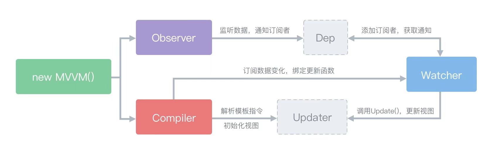

## vue面试题
#### Vue双向绑定原理

> View的变化能实时让Model发生变化，而Model的变化也能实时更新到View

> Vue采用数据劫持和发布订阅模式的方式，通过Object.defineProperty方法来劫持(监控)各属性的getter、setter，并在数据(对象)发生变动时通知订阅者，触发相应的监听函数。并且，由于是在不同的数据上触发同步，可以精确的将更变发送给绑定的视图。而不是对所有数据都执行一次检测。


- Observer 数据监听器：负责对数据对象的所有属性进行监听(劫持)，监听到数据变化后通知订阅者
- Compiler 指令解析器：扫描模板，并对指令进行解析，然后绑定指定事件
- Watcher 订阅者：关联Observer和Compiler，能够订阅并收到属性变更的通知，执行指令绑定的相应操作，更新视图。

##### 版本比较

**2.0版本优点**

- 不需要显示的调用，Vue利用数据劫持+发布订阅，可以直接通知变化并且驱动视图
- 劫持了属性的setter，当属性变化时，可以直接获取到变化后的内容

**2.0版本缺点**
- 不能监听数组，由于数组长度不确定，如果太长性能负担太大
- 只能监听属性，而不是对象，需要遍历
- 只能监听属性的变化，而不能监听属性的删减

**3.0版本优点**
- 可以监听数组
- 监听整个对象不是属性
- 13种拦截方式
- 返回新对象而不是直接修改原有对象

**3.0版本缺点**
- 兼容性不好

#### Vue的生命周期


#### Vue与React区别
相同点：
- 都使用了Virtual DOM
- 提供了响应式和组件化的师徒组件
- 将注意力集中保持在核心库，其他功能交给相应的库

不同点：
- vue采用template形式，提倡html、css、js分离，react采用jsx语法
- vue单个文件css作用域(scoped)，react是通过Css-in-js的方式(style-commponent)
- react的生态比vue更加繁荣

#### Vue组件传递
- props 向下传递
- attr 传递
- provide/inject
- $children/$parent
- eventsBus
- vuex

#### minix和extend
> minix：混入，他会将与vue的options进行合并，生命周期要先于组件的调用，其他同名会被组件定义的覆盖

> extend：构造，构造一个Vue的子类

#### 嵌套组件执行顺序
创建挂载：beforeCreate(父) -> created(父) -> beforeMount(父) -> beforeCreate(子) -> created(子) -> beforeMount(子) -> mounted(子) -> mounte(父)

更新/销毁：beforeUpdate(父) -> beforeUpdate(子) -> updated(子) -> updated(父)

#### Vuex
> 状态管理[用法](https://github.com/limin0428/vue-applet-skeleton/tree/master/src/store)
- store: 仓库
- mutations: 修改(同步)
- commit: 提交mutations
- actions: 修改(异步)
- dispath: 提交actions
- getters: 映射性取值

#### EventBus的实现
> 利用发布订阅模式
```js
class Bus {
  constructor () {
    this.callbacks = {}
  }
  $on(name,fn) {
    this.callbacks[name] = this.callbacks[name] || []
    this.callbacks[name].push(fn)
  }
  $emit(name,args) {
    if(this.callbacks[name]){
       //存在遍历所有callback
       this.callbacks[name].forEach(cb => cb(args))
    }
  }
}
```

#### VueRouter
> mode: 模式 history模式、hash模式
- history模式: 监听popstate
- hash模式: 监听hashchange

##### 路由钩子
- 全局钩子
- 路由专属钩子
- 组件内钩子

##### 路由懒加载
- [vue的异步组件](https://cn.vuejs.org/v2/guide/components-dynamic-async.html#%E5%BC%82%E6%AD%A5%E7%BB%84%E4%BB%B6)
```js
export default new Router({
  routes: [
    {
      path: '/xxx',
      name: 'xxx',
      // 每一个异步组件会单独生成一个js文件
      component: resolve => require(['路径'], resolve)
    }
  ]
})
```
- ES6动态导入[import()](https://webpack.docschina.org/api/module-methods/#import)
```js
export default new Router({
  routes: [
    {
      path: '/xxx',
      name: 'xxx',
      // webpackChunkName chunk名称 同名会合并打包成一个js文件
      component: () => import(/* webpackChunkName: 'name' */ '路径')
    },
    {
      path: '/yyy',
      name: 'yyy',
      // webpackChunkName chunk名称
      component: () => import(/* webpackChunkName: 'name' */ '路径')
    },
  ]
})
```
- webpack提供的[require.ensure](https://webpack.docschina.org/api/module-methods/)(已被import()替代)
```js
require.ensure(
  // callback依赖的模块
  dependencies: String[],
  // 依赖加载完成后，webpack执行的回调
  callback: function(require),
  // webpack加载失败时执行的回调
  errorCallback: function(error),
  // 创建的chunk的名称，同名的会合并生成一个chunk
  chunkName: String
)
```

```js
export default new Router({
  routes: [
    {
      path: '/xxx',
      name: 'xxx',
      component: resolve => require.ensure([], (require) => resolve(require('路径'), error => {}, 'chunkName')  
    },
  ]
})
```

#### Vue2.0与Vue3.0
- Vue2.0采用flow进行编写