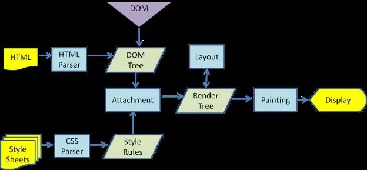

## CSS面试题
####  伪类和伪元素
> 伪类：元素的特殊效果，例如:focus、active、hover

> 伪元素：DOM树没有定义的虚拟元素，例如:before、after

#### 盒模型

 对比 | 标准盒模型 | 怪异盒模型
:---: |:---:| :---:
box-sizing | content-box | border-box
内容计算 | 宽(高) = width(height) | 宽(高) = width(height) + padding + border

#### Css选择器
- 通配符：*
- 标签选择器：div
- 类选择器：.nav-bar
- ID选择器：#nav-bar
- 相邻选择器：h5+p
- 子选择器：.nav-bar>div
- 后代选择器：.nav-bar div
- 属性选择器：div[data-type="red"]

#### link和@import
> link：XHTML的标签，无兼容问题，在页面载入时，同时加载

> @import：属于css规则，低版本浏览器不支持，在页面完全载入后加载(一开始没有样式，闪烁后出现样式)

#### Css单位

##### 相对单位
单位 | 描述
:---:|:---:
em | 相当于当前元素的字体尺寸
ex | 依赖于英文字母小x的高度
ch | 数字0的宽度
rem | 根元素(html)的font-size
vw | 相对于视口宽度的百分比
vh | 相对于视口高度的百分比
vmin | vw和vh较小的
vmax | vw和vh较大的
% | 父级元素的百分比

##### 绝对单位
单位 | 描述
:---:|:---:
cm | 厘米
mm | 毫米
in | 英尺(1in = 96px = 2.54cm)
px | 像素

#### Css动画
> transition：property duration timing-function delay

属性 | 描述
:---:|:---:
property | 添加过渡效果的属性名称
duration | 过渡完成时间
timing-function | 速度曲线
delay | 过渡何时开始
```css
.move {
    transition: left 1s, background 0.7s
}
```
> animation：name duration time-function delay iteration-count direction play-state fill-mode

属性 | 描述
:---:|:---:
name | 调用@keyframes定义的动画名称
duration | 动画时间
timing-function | 速度曲线
delay | 延迟时间
iteration-count | 动画播放次数
direction | 动画播放方向
play-state | 播放状态
fill-mode | 动画结束后，元素的样式
```css
.move {
    animation: move 3s linear 0.5s
}
@keyframes move {
    0% {
        left: 0;
        background: red;
    }
    100% {
        left: 300px;
        background: blue
    }
}
```

#### 浏览器渲染



渲染步骤：
- 浏览解析html，生成DOM tree(深度优先)
- 解析css，生成css rule tree
- DOM tree和cssOM构造render tree
- layout(已知各个节点的css定义和从属关系，计算每个节点出现在屏幕中的位置)
- 绘制
- 显示

##### 回流、重绘
> 回流：页面布局发生变化时，DOM重新构建，渲染树也会重新渲染(是否触发layout)

> 重绘：是否触发painting

##### 回流触发
- 页面首次渲染
- 元素删减
- 几何属性变化(尺寸)
- 元素位置变更
- 获取元素的偏移量属性(浏览器为了保证值的正确也会回流获取最新的值)
- resize事件

##### transform和marginTop
> transform是通过创建一个RenderLayers(渲染)合成层，拥有独立的GraphicsLayers(绘图层)，每一个GraphicsLayers都有一个Graphics content进行绘制，输出位图合并展示(只触发重绘)

##### 独立的合成层
- 有3D或者transform的css属性的层
- video、canvas元素的层
- flash

#### 布局方式
- 静态块级
- 弹性布局(flex)
- 响应式布局
- 浮动布局
- 定位布局

##### 清除浮动
- 设置父元素的高
- 浮动元素后添加空元素，clear：both
- 父元素后添加伪元素，clear：both
- 触发BFC

#### BFC

> BFC：块级格式上下文，是页面上一个隔离的独立容器，容器的子元素不会影响到外面的元素，反之亦然

##### BFC特性
- 使BFC内部浮动元素不会导出乱跑
- 和浮动元素产生边界

##### BFC触发条件
- 根元素和其他包含它的元素
- 浮动元素(非float:none)
- 绝对定位元素(position:absolute/fixed)
- 非overflow:visible
- display:inline-block/table-cell/table-caption/flow-root

#### 单行/多行溢出省略号
```css
<!--单行-->
.single-ellipsis {
    overflow: hidden;
    white-space: nowrap;
    text-overflow: ellipsis
}
<!--多行-->
.mutiline-ellipsis {
    display: -webkit-box;
    -webkit-box-orient: vertical;
    -webkit-line-clamp: 3;
    word-break: break-all;
    overflow: hidden;
    text-overflow: ellipsis;
}
```

#### 如何实现两边固定，中间自适应
- 定位
- calc(动态计算)
- flex

[code demo](../../code/demo1.html)

#### 响应式布局
- 缩放类(rem、百分比、vw/vh、scale)
- 尺寸匹配(媒体查询)

##### 缩放
- rem：依赖于根元素html的font-size
- 百分比：依赖于父级元素
- vw/vh：依赖于视口大小
- scale: 整体缩放
    
[postcss-pxtorem](https://www.npmjs.com/package/postcss-plugin-px2rem)

##### postcss-pxtorm用法

> 通用文件rem.js
```
function setRem() {
    // 设计稿320px  默认大小16px; 320px = 20rem
    // 设计稿375px  默认大小37.5px; 375px = 10rem
    let htmlWidth = document.documentElement.clientWidth || document.body.clientWidth;
    //得到html的Dom元素
    let htmlDom = document.getElementsByTagName('html')[0];
    //设置根元素字体大小
    htmlDom.style.fontSize = htmlWidth / 20 + 'px';
}
// 初始化
setRem();
// 改变窗口大小时重新设置 rem
window.onresize = function () {
    setRem()
}
```

> package.json配置

```
// npm install postcss-pxtorem
"postcss": {
    "plugins": {
      "autoprefixer": {},
      "postcss-pxtorem": {
        "rootValue": 16,
        "propList": ["*]
      }
    }
},
// main.js
import './rem.js'
```

> postcss.config.js配置(文件没有自己创建)

```
// npm install postcss-pxtorem
module.exports = {
    plugins: {
        'autoprefixer': {
            browsers: ['Android >= 4.0', 'iOS >= 7']
        },
        'postcss-pxtorem': {
            rootValue: 16,
            propList: ['*']
        }
    }
}
// main.js
import './rem.js'
```

> vue.config.js配置
```
// npm i amfe-flexible -S  npm i postcss-pxtorem -D
module.exports = {
	css: {
		loaderOptions: {
			postcss: {
				plugins: [
					require("autoprefixer")({
						// 配置使用 autoprefixer
						overrideBrowserslist: ["last 15 versions"]
					}),
					require("postcss-pxtorem")({
						rootValue: 16, // 换算的基数
						unitPrecision: 6, // 允许rem单位精度
						propWhiteList: [], // 允许换算白名单(空数组表示禁用白名单，全部转换)
						propBlackList: [], // 不允许转换名单
						exclude: /node_modules/, // 排除文件夹
						selectorBlackList: ["ig"], // 忽略的选择器，保留px
						// propList: ["*"],
					})
				]
			}
		}
	}
};
```

> 备注：如果报错：Error: PostCSS plugin postcss-pxtorem requires PostCSS 8，切换postcss-pxtorem@5.1.1

#### css预处理器
> 为css增加编程特性的拓展语言，可以使用变量、简单逻辑判断、函数等基本编程技巧

##### Less(Saas)
- 样式嵌套
```
.layout{
    .header {
        width:200px
    }
}
```
- 变量
```
@fontSize: 16px;
@successColor: #aaa;
<!--SaaS 变量 $successColor: #aaa; -->
.success{
    color: @successColor
}
```
- mixin
```
<!-- less -->
@fontSize: 16px;
.default(@fontSize){
    font-size: @fontSize;
    border: 1px silod #ddd;
    border-radius: 4px;
}
.nav {
    .default(@fontSize - 2px)
}
<!-- saas -->
$fontSize: 16px;
@mixin default(@fontSize){
    font-size: $fontSize;
    border: 1px silod #ddd;
    border-radius: 4px;
}
.nav {
    @include default($fontSize - 2px)
}
```

- extend
```
<!-- less -->
.default {
    font-size: 16px;
    border: 1px silod #ddd;
    border-radius: 4px;
}
.nav:extend(.default) {
    color: #ddd
}
<!-- saas -->
.nav{
    @extend .default;
    color: #ddd
}
```
